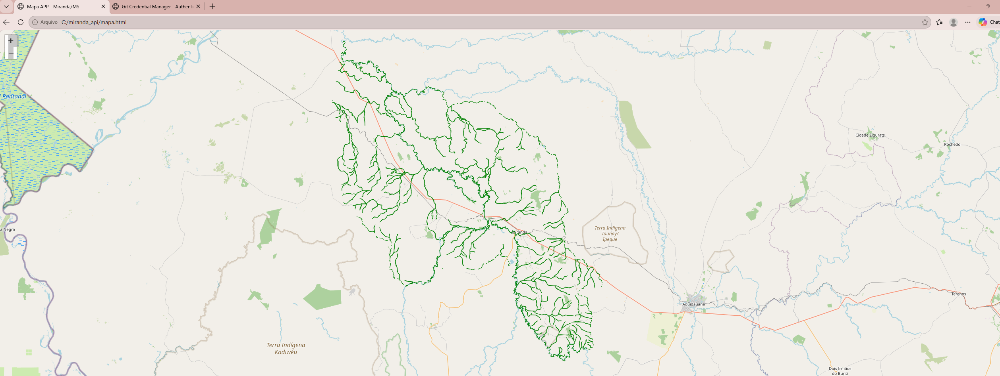

# WebGIS Miranda

A full-stack WebGIS application developed to visualize geospatial data and riparian protection areas related to the hydrographic network of Miranda, Mato Grosso do Sul, Brazil.

## Project Preview



## Technologies

* Python
* FastAPI
* PostgreSQL
* PostGIS
* GeoJSON
* Leaflet
* QGIS
* Git
* GitHub

## Architecture

PostGIS → FastAPI → GeoJSON → Leaflet

## Features

* Geospatial data storage using PostgreSQL and PostGIS
* Spatial SQL queries
* REST API development with FastAPI
* PostGIS geometry conversion to GeoJSON
* Interactive map visualization using Leaflet
* Coordinate system transformation for web mapping
* Integration between spatial database, backend API, and frontend map

## Project Structure

The application follows a simple full-stack geospatial architecture:

1. Spatial data is stored and processed in PostgreSQL/PostGIS.
2. FastAPI connects to the database and executes spatial queries.
3. Geometries are transformed and returned as GeoJSON.
4. Leaflet consumes the GeoJSON data and displays the results on an interactive web map.

## API

The backend exposes geospatial data through REST endpoints.

Example endpoint:

```text
/app-hidrografia
```

This endpoint retrieves spatial features from PostGIS and returns them as a GeoJSON `FeatureCollection`.

## Spatial Data Processing

The project uses PostGIS spatial functions such as:

```sql
ST_AsGeoJSON()
ST_Transform()
```

These functions are used to convert database geometries into GeoJSON and transform spatial data into the WGS 84 coordinate reference system (`EPSG:4326`) for web visualization.

## Running the Project Locally

Start the FastAPI server with:

```bash
uvicorn main:app --reload --port 8001
```

Then access the API documentation at:

```text
http://127.0.0.1:8001/docs
```

The interactive WebGIS interface can be opened through the project's HTML file.

## Current Status

The project is currently configured to run locally.

The backend API communicates with a local PostgreSQL/PostGIS database, while the frontend uses Leaflet to visualize the spatial data.

## Purpose

This project was developed as a practical demonstration of full-stack geospatial development, combining GIS, spatial databases, backend development, REST APIs, and interactive web mapping.

It demonstrates how geospatial workflows traditionally performed in desktop GIS environments can be integrated into a web-based application architecture.

## Author

**Victória Souza**

Environmental Engineer | Full-Stack Geospatial Developer

Skills applied in this project include:

* Geographic Information Systems
* Spatial databases
* Geospatial analysis
* Python development
* REST API development
* Web mapping
* QGIS
* PostGIS
* Full-stack geospatial application development
